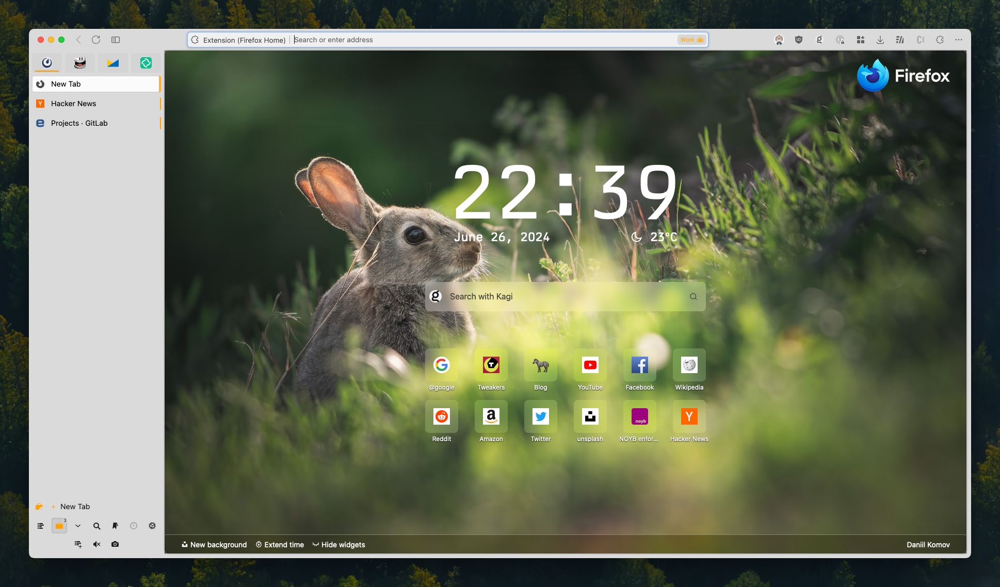

# Home! Sweet Home!

This is a Firefox extension that I use to personalize my new tab page.

## Development

To develop this extension, you need to have [Node.js](https://nodejs.org/en/) and [npm](https://www.npmjs.com/) installed.

Install the dependencies by running `npm install`.

To build the extension, run `npm run build`.

To start the development server, run `npm start`.

Or start developing by loading a temporary unpacked extension in Firefox. To do this, open Firefox and go to `about:debugging`. Click on "Load Temporary Add-on" and select the `manifest.json` file in the extension directory.

## License

This project is licensed under the MIT License.
